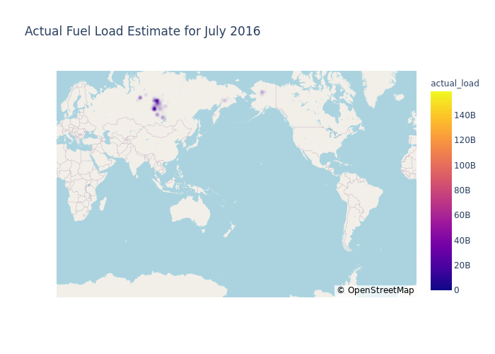
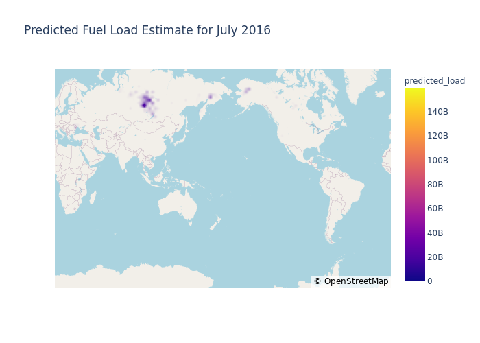

CatBoost inference
==================

This notebooks demonstrates generating inferences from a pretrained
CatBoost model. This notebook utilizes the ``deepfuel-ML/src/test.py``
script for generating inferences. The script does everything from
calculating error values to plotting data for visual inference.

.. code:: ipython3

    import os
    import pandas as pd
    import numpy as np
    from joblib import dump, load
    from IPython.display import Image, display

Using ``test.py``
~~~~~~~~~~~~~~~~~

Below is the description of its arguements: - ``--model_name``: Name of
the model to be trained (“CatBoost” or “LightGBM”). - ``--model_path``:
Path to the pre-trained model. - ``--data_path``: Valid data directory
where all the test .csv files are stored. - ``--results_path``:
Directory where the result inference .csv files and .png visualizations
are going to be stored.

With Ground Truth (``actual_load`` is present in the test csv)
~~~~~~~~~~~~~~~~~~~~~~~~~~~~~~~~~~~~~~~~~~~~~~~~~~~~~~~~~~~~~~

.. code:: ipython3

    !python '../src/test.py'  --model_name 'CatBoost' --model_path '../src/results/pre-trained_models/CatBoost.joblib' --data_path '../data/infer_midlats'  --results_path '../data/midlats/results'

.. parsed-literal::

    MAPE  Dec  : 100.96611384246981
    MAPE  Nov  : 108.86358928749473
    MAPE  Sept  : 194.6900609800412
    MAPE  Oct  : 116.71573239977016
    MAPE  Aug  : 302.66263552492586
    MAPE  July  : 356.2327529057079
    Actual FL plot successfully generated! File saved to  ../data/midlats/results/midlats_Nov_actual.png
    Predicted FL plot successfully generated! File saved to  ../data/midlats/results/midlats_Nov_predicted.png
    Actual FL plot successfully generated! File saved to  ../data/midlats/results/midlats_July_actual.png
    Predicted FL plot successfully generated! File saved to  ../data/midlats/results/midlats_July_predicted.png
    Actual FL plot successfully generated! File saved to  ../data/midlats/results/midlats_Dec_actual.png
    Predicted FL plot successfully generated! File saved to  ../data/midlats/results/midlats_Dec_predicted.png
    Actual FL plot successfully generated! File saved to  ../data/midlats/results/midlats_Aug_actual.png
    Predicted FL plot successfully generated! File saved to  ../data/midlats/results/midlats_Aug_predicted.png
    Actual FL plot successfully generated! File saved to  ../data/midlats/results/midlats_Oct_actual.png
    Predicted FL plot successfully generated! File saved to  ../data/midlats/results/midlats_Oct_predicted.png
    Actual FL plot successfully generated! File saved to  ../data/midlats/results/midlats_Sept_actual.png
    Predicted FL plot successfully generated! File saved to  ../data/midlats/results/midlats_Sept_predicted.png

Inference CSV
~~~~~~~~~~~~~

``test.py`` generates ``.csv`` files for each month with the following
columns: - ``latitude`` - ``longitude`` - ``actual_load`` - Actual Fuel
Load value - ``predicted_load`` - Predicted Fuel Load value - ``APE`` -
Average Percentage Error between actual and predicted fuel load values

.. code:: ipython3

    df=pd.read_csv('../data/midlats/results/midlats_output_July.csv')
    df.head()

.. raw:: html

    

    
    <table border="1" class="dataframe">
      <thead>
        <tr style="text-align: right;">
          <th></th>
          <th>lat</th>
          <th>lon</th>
          <th>actual_load</th>
          <th>predicted_load</th>
          <th>APE</th>
        </tr>
      </thead>
      <tbody>
        <tr>
          <th>0</th>
          <td>-35.125</td>
          <td>-69.375</td>
          <td>9.188477e+07</td>
          <td>2.271982e+08</td>
          <td>147.264254</td>
        </tr>
        <tr>
          <th>1</th>
          <td>-31.625</td>
          <td>27.875</td>
          <td>7.486465e+07</td>
          <td>5.049583e+08</td>
          <td>574.494995</td>
        </tr>
        <tr>
          <th>2</th>
          <td>-31.375</td>
          <td>28.375</td>
          <td>6.728101e+07</td>
          <td>4.995424e+08</td>
          <td>642.471533</td>
        </tr>
        <tr>
          <th>3</th>
          <td>-31.125</td>
          <td>28.625</td>
          <td>9.200570e+07</td>
          <td>5.052560e+08</td>
          <td>449.157279</td>
        </tr>
        <tr>
          <th>4</th>
          <td>-31.125</td>
          <td>29.625</td>
          <td>1.413486e+08</td>
          <td>4.898777e+08</td>
          <td>246.574236</td>
        </tr>
      </tbody>
    </table>
    

Visualizing the plots generated
~~~~~~~~~~~~~~~~~~~~~~~~~~~~~~~

.. code:: ipython3

    actual=Image(filename='../data/midlats/results/midlats_July_actual.png')
    predicted=Image(filename='../data/midlats/results/midlats_July_predicted.png')
    display(actual,predicted)

Without Ground Truth (``actual_load`` is not present in the test csv)
~~~~~~~~~~~~~~~~~~~~~~~~~~~~~~~~~~~~~~~~~~~~~~~~~~~~~~~~~~~~~~~~~~~~~

.. code:: ipython3

    !python '../src/test.py'  --model_name 'CatBoost' --model_path '../src/results/pre-trained_models/CatBoost.joblib' --data_path '../data/infer_midlats'  --results_path '../data/midlats/results'

.. parsed-literal::

    MAPE  Dec  : 100.96611384246981
    MAPE  Nov  : 108.86358928749473
    MAPE  Sept  : 194.6900609800412
    MAPE  Oct  : 116.71573239977016
    MAPE  Aug  : 302.66263552492586
    MAPE  July  : 356.2327529057079
    Actual FL plot successfully generated! File saved to  ../data/midlats/results/midlats_Nov_actual.png
    Predicted FL plot successfully generated! File saved to  ../data/midlats/results/midlats_Nov_predicted.png
    Actual FL plot successfully generated! File saved to  ../data/midlats/results/midlats_July_actual.png
    Predicted FL plot successfully generated! File saved to  ../data/midlats/results/midlats_July_predicted.png
    Actual FL plot successfully generated! File saved to  ../data/midlats/results/midlats_Dec_actual.png
    Predicted FL plot successfully generated! File saved to  ../data/midlats/results/midlats_Dec_predicted.png
    Actual FL plot successfully generated! File saved to  ../data/midlats/results/midlats_Aug_actual.png
    Predicted FL plot successfully generated! File saved to  ../data/midlats/results/midlats_Aug_predicted.png
    Actual FL plot successfully generated! File saved to  ../data/midlats/results/midlats_Oct_actual.png
    Predicted FL plot successfully generated! File saved to  ../data/midlats/results/midlats_Oct_predicted.png
    Actual FL plot successfully generated! File saved to  ../data/midlats/results/midlats_Sept_actual.png
    Predicted FL plot successfully generated! File saved to  ../data/midlats/results/midlats_Sept_predicted.png

Inference CSV
~~~~~~~~~~~~~

.. code:: ipython3

    df=pd.read_csv('../data/midlats/results/midlats_output_July.csv')
    df.head()

.. raw:: html

    

    
    <table border="1" class="dataframe">
      <thead>
        <tr style="text-align: right;">
          <th></th>
          <th>lat</th>
          <th>lon</th>
          <th>actual_load</th>
          <th>predicted_load</th>
          <th>APE</th>
        </tr>
      </thead>
      <tbody>
        <tr>
          <th>0</th>
          <td>-35.125</td>
          <td>-69.375</td>
          <td>9.188477e+07</td>
          <td>2.271982e+08</td>
          <td>147.264254</td>
        </tr>
        <tr>
          <th>1</th>
          <td>-31.625</td>
          <td>27.875</td>
          <td>7.486465e+07</td>
          <td>5.049583e+08</td>
          <td>574.494995</td>
        </tr>
        <tr>
          <th>2</th>
          <td>-31.375</td>
          <td>28.375</td>
          <td>6.728101e+07</td>
          <td>4.995424e+08</td>
          <td>642.471533</td>
        </tr>
        <tr>
          <th>3</th>
          <td>-31.125</td>
          <td>28.625</td>
          <td>9.200570e+07</td>
          <td>5.052560e+08</td>
          <td>449.157279</td>
        </tr>
        <tr>
          <th>4</th>
          <td>-31.125</td>
          <td>29.625</td>
          <td>1.413486e+08</td>
          <td>4.898777e+08</td>
          <td>246.574236</td>
        </tr>
      </tbody>
    </table>
    

.. code:: ipython3

    ### Visualizing the plots generated

.. code:: ipython3

    predicted=Image(filename='../data/midlats/results/midlats_July_predicted.png')
    display(predicted)

