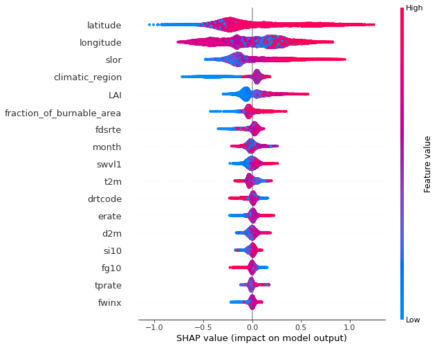

Training CatBoost (Mid-Latitudes)
================================================================

This notebooks demonstrates training a CatBoost model with
hyperparameter optimization, followed by feature importance
visualization using SHAP. CatBoost is a machine learning algorithm that
uses gradient boosting on decision trees. This notebook utilizes the
``deepfuel-ML/src/models/catboost_module.py`` script for model training.

.. code:: ipython3

    import os
    import pandas as pd
    import numpy as np
    from joblib import dump, load
    import shap

Data directory
~~~~~~~~~~~~~~

.. code:: ipython3

    # The training, validation and test set required for model training are placed in data/midlats/
    ! tree ../data/midlats

.. parsed-literal::

    ../data/midlats
    ├── midlats_test.csv
    ├── midlats_train.csv
    └── midlats_val.csv

    0 directories, 3 files

Input Features
~~~~~~~~~~~~~~

-  Latitude
-  Longitude
-  Leaf Area Index
-  Fire Weather Index: fwinx
-  Drought Code: drtcode
-  Fire Danegr Severity Rating: fdsrte
-  Fraction of Burnable Area: fraction_of_burnable_area
-  d2m
-  Evaporation Rate: erate
-  fg10
-  si10
-  Volumetric Soil Water Level 1: swvl1
-  2m Temperature: t2m
-  tprate
-  Climatic Region: climatic_region
-  Slope: slor
-  Month: month
-  Fuel Load: actual_load (target variable)

.. code:: ipython3

    # Check header of training set matches input features
    ! head -n 1 ../data/midlats/midlats_train.csv

.. parsed-literal::

    latitude,longitude,LAI,fwinx,drtcode,fdsrte,fraction_of_burnable_area,d2m,erate,fg10,si10,swvl1,t2m,tprate,climatic_region,slor,actual_load,month

Model Training
~~~~~~~~~~~~~~

.. code:: ipython3

    !python '../src/train.py'  --model_name 'CatBoost' --data_path '../data/midlats/' --exp_name 'CatBoost_exp'

.. parsed-literal::

    Link for the created Neptune experiment--------
    Info (NVML): NVML Shared Library Not Found. GPU usage metrics may not be reported. For more information, see https://docs.neptune.ai/logging-and-managing-experiment-results/logging-experiment-data.html#hardware-consumption
    https://ui.neptune.ai/shared/step-by-step-monitoring-experiments-live/e/STEP-163
    ---------------------------------------
    0:	learn: 0.9193915	test: 0.9374665	best: 0.9374665 (0)	total: 78.9ms	remaining: 1m 18s
    1:	learn: 0.8572337	test: 0.8807920	best: 0.8807920 (1)	total: 90.4ms	remaining: 45.1s
    2:	learn: 0.8133704	test: 0.8472102	best: 0.8472102 (2)	total: 105ms	remaining: 34.9s
    3:	learn: 0.7751241	test: 0.8134123	best: 0.8134123 (3)	total: 119ms	remaining: 29.6s
    4:	learn: 0.7455154	test: 0.7849642	best: 0.7849642 (4)	total: 134ms	remaining: 26.7s
    5:	learn: 0.7227938	test: 0.7619387	best: 0.7619387 (5)	total: 147ms	remaining: 24.3s
    . . .
    315:	learn: 0.4626048	test: 0.6321089	best: 0.6305450 (299)	total: 4.34s	remaining: 9.4s
    316:	learn: 0.4623857	test: 0.6320927	best: 0.6305450 (299)	total: 4.36s	remaining: 9.39s
    317:	learn: 0.4622255	test: 0.6321369	best: 0.6305450 (299)	total: 4.37s	remaining: 9.37s
    318:	learn: 0.4618840	test: 0.6320915	best: 0.6305450 (299)	total: 4.38s	remaining: 9.36s
    319:	learn: 0.4616440	test: 0.6317562	best: 0.6305450 (299)	total: 4.4s	remaining: 9.35s
    Stopped by overfitting detector  (20 iterations wait)

    bestTest = 0.6305450201
    bestIteration = 299

    Shrink model to first 300 iterations.
    RMSE  : 0.6305450197747737
    -----------------------------------------------------------------
    Inference results

    Training error:  2039187852.5081983
    Validation error:  2854273450.7074313
    Test error:  2231005975.951971
    Model file save at ['/Users/rbiswas/VSCodeProjects/deepfuel-ML/src/results/pre-trained_models/CatBoost.joblib']

The training logs can be viewed live online at the following link:
https://ui.neptune.ai/shared/step-by-step-monitoring-experiments-live/e/STEP-158

Loading the trained model
~~~~~~~~~~~~~~~~~~~~~~~~~

.. code:: ipython3

    model = load('../src/results/pre-trained_models/CatBoost.joblib')

Feature importance using SHAP
~~~~~~~~~~~~~~~~~~~~~~~~~~~~~

`SHAP <https://github.com/slundberg/shap>`__ (SHapley Additive
exPlanations) is used to explain the output of the trained machine
learning model.

.. code:: ipython3

    midlat_train = pd.read_csv('../data/midlats/midlats_train.csv')

.. code:: ipython3

    shap_values = shap.TreeExplainer(model).shap_values(midlat_train.drop([ 'actual_load'], axis=1))
    shap.summary_plot(shap_values, midlat_train.drop(['actual_load'], axis=1))

The y-axis indicates the variable name, in order of importance from top
to bottom. On the x-axis (Impact on model output), the horizontal
location shows whether the effect of that value is associated with a
higher or lower prediction. Gradient colour indicates feature value.
