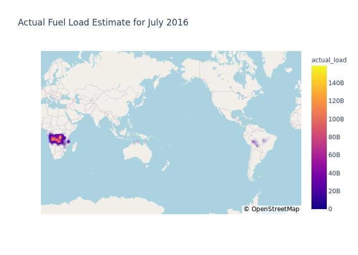

LightGBM inference
==================

This notebooks demonstrates generating inferences from a pretrained
LightGBM model. This notebook utilizes the ``deepfuel-ML/src/test.py``
script for generating inferences. The script does everything from
calculating error values to plotting data for visual inference.

.. code:: ipython3

    import os
    import pandas as pd
    import numpy as np
    from joblib import dump, load
    import sys
    import os
    from IPython.display import Image, display

Using ``test.py``
~~~~~~~~~~~~~~~~~

Below is the description of its arguements: - ``--model_name``: Name of
the model to be trained (“CatBoost” or “LightGBM”). - ``--model_path``:
Path to the pre-trained model. - ``--data_path``: Valid data directory
where all the test .csv files are stored. - ``--results_path``:
Directory where the result inference .csv files and .png visualizations
are going to be stored.

With Ground Truth (``actual_load`` is present in the test csv)
~~~~~~~~~~~~~~~~~~~~~~~~~~~~~~~~~~~~~~~~~~~~~~~~~~~~~~~~~~~~~~

.. code:: ipython3

    !python '../src/test.py'  --model_name 'LightGBM' --model_path '../src/results/pre-trained_models/LightGBM.joblib' --data_path '../data/infer_tropics'  --results_path '../data/tropics/results'

.. parsed-literal::

    MAPE  Nov  : 2702.06167971773
    MAPE  July  : 1061.9047437881936
    MAPE  Aug  : 8841.281290977906
    MAPE  Oct  : 1272.2122715591902
    MAPE  Dec  : 923.7465140033098
    MAPE  Sept  : 3424.427580350033
    Actual FL plot successfully generated! File saved to  ../data/tropics/results/tropics_Nov_actual.png
    Predicted FL plot successfully generated! File saved to  ../data/tropics/results/tropics_Nov_predicted.png
    Actual FL plot successfully generated! File saved to  ../data/tropics/results/tropics_Aug_actual.png
    Predicted FL plot successfully generated! File saved to  ../data/tropics/results/tropics_Aug_predicted.png
    Actual FL plot successfully generated! File saved to  ../data/tropics/results/tropics_Dec_actual.png
    Predicted FL plot successfully generated! File saved to  ../data/tropics/results/tropics_Dec_predicted.png
    Actual FL plot successfully generated! File saved to  ../data/tropics/results/tropics_Oct_actual.png
    Predicted FL plot successfully generated! File saved to  ../data/tropics/results/tropics_Oct_predicted.png
    Actual FL plot successfully generated! File saved to  ../data/tropics/results/tropics_July_actual.png
    Predicted FL plot successfully generated! File saved to  ../data/tropics/results/tropics_July_predicted.png
    Actual FL plot successfully generated! File saved to  ../data/tropics/results/tropics_Sept_actual.png
    Predicted FL plot successfully generated! File saved to  ../data/tropics/results/tropics_Sept_predicted.png

Inference CSV
~~~~~~~~~~~~~

``test.py`` generates ``.csv`` files for each month with the following
columns: - ``latitude`` - ``longitude`` - ``actual_load`` - Actual Fuel
Load value - ``predicted_load`` - Predicted Fuel Load value - ``APE`` -
Average Percentage Error between actual and predicted fuel load values

.. code:: ipython3

    df=pd.read_csv('../data/tropics/results/tropics_output_July.csv')
    df.head()

.. raw:: html

    

    
    <table border="1" class="dataframe">
      <thead>
        <tr style="text-align: right;">
          <th></th>
          <th>lat</th>
          <th>lon</th>
          <th>actual_load</th>
          <th>predicted_load</th>
          <th>APE</th>
        </tr>
      </thead>
      <tbody>
        <tr>
          <th>0</th>
          <td>-29.875</td>
          <td>29.125</td>
          <td>1.876688e+08</td>
          <td>1.073418e+09</td>
          <td>471.974876</td>
        </tr>
        <tr>
          <th>1</th>
          <td>-29.875</td>
          <td>29.375</td>
          <td>2.971511e+08</td>
          <td>8.908525e+08</td>
          <td>199.797835</td>
        </tr>
        <tr>
          <th>2</th>
          <td>-29.875</td>
          <td>29.625</td>
          <td>1.518198e+08</td>
          <td>8.945157e+08</td>
          <td>489.195632</td>
        </tr>
        <tr>
          <th>3</th>
          <td>-29.875</td>
          <td>29.875</td>
          <td>3.022351e+08</td>
          <td>9.046868e+08</td>
          <td>199.332100</td>
        </tr>
        <tr>
          <th>4</th>
          <td>-29.875</td>
          <td>30.125</td>
          <td>3.009002e+08</td>
          <td>1.050267e+09</td>
          <td>249.041709</td>
        </tr>
      </tbody>
    </table>
    

Visualizing the plots generated
~~~~~~~~~~~~~~~~~~~~~~~~~~~~~~~

.. code:: ipython3

    actual=Image(filename='../data/tropics/results/tropics_July_actual.png')
    predicted=Image(filename='../data/tropics/results/tropics_July_predicted.png')
    display(actual,predicted)

Without Ground Truth (``actual_load`` is not present in the test csv)
~~~~~~~~~~~~~~~~~~~~~~~~~~~~~~~~~~~~~~~~~~~~~~~~~~~~~~~~~~~~~~~~~~~~~

.. code:: ipython3

    !python '../src/test.py'  --model_name 'LightGBM' --model_path '../src/results/pre-trained_models/LightGBM.joblib' --data_path '../data/infer_tropics'  --results_path '../data/tropics/results'

.. parsed-literal::

    MAPE  Nov  : 2702.06167971773
    MAPE  July  : 1061.9047437881936
    MAPE  Aug  : 8841.281290977906
    MAPE  Oct  : 1272.2122715591902
    MAPE  Dec  : 923.7465140033098
    MAPE  Sept  : 3424.427580350033
    Actual FL plot successfully generated! File saved to  ../data/tropics/results/tropics_Nov_actual.png
    Predicted FL plot successfully generated! File saved to  ../data/tropics/results/tropics_Nov_predicted.png
    Actual FL plot successfully generated! File saved to  ../data/tropics/results/tropics_Aug_actual.png
    Predicted FL plot successfully generated! File saved to  ../data/tropics/results/tropics_Aug_predicted.png
    Actual FL plot successfully generated! File saved to  ../data/tropics/results/tropics_Dec_actual.png
    Predicted FL plot successfully generated! File saved to  ../data/tropics/results/tropics_Dec_predicted.png
    Actual FL plot successfully generated! File saved to  ../data/tropics/results/tropics_Oct_actual.png
    Predicted FL plot successfully generated! File saved to  ../data/tropics/results/tropics_Oct_predicted.png
    Actual FL plot successfully generated! File saved to  ../data/tropics/results/tropics_July_actual.png
    Predicted FL plot successfully generated! File saved to  ../data/tropics/results/tropics_July_predicted.png
    Actual FL plot successfully generated! File saved to  ../data/tropics/results/tropics_Sept_actual.png
    Predicted FL plot successfully generated! File saved to  ../data/tropics/results/tropics_Sept_predicted.png

Inference CSV
~~~~~~~~~~~~~

.. code:: ipython3

    df=pd.read_csv('../data/tropics/results/tropics_output_July.csv')
    df.head()

.. raw:: html

    

    
    <table border="1" class="dataframe">
      <thead>
        <tr style="text-align: right;">
          <th></th>
          <th>lat</th>
          <th>lon</th>
          <th>actual_load</th>
          <th>predicted_load</th>
          <th>APE</th>
        </tr>
      </thead>
      <tbody>
        <tr>
          <th>0</th>
          <td>-29.875</td>
          <td>29.125</td>
          <td>1.876688e+08</td>
          <td>1.073418e+09</td>
          <td>471.974876</td>
        </tr>
        <tr>
          <th>1</th>
          <td>-29.875</td>
          <td>29.375</td>
          <td>2.971511e+08</td>
          <td>8.908525e+08</td>
          <td>199.797835</td>
        </tr>
        <tr>
          <th>2</th>
          <td>-29.875</td>
          <td>29.625</td>
          <td>1.518198e+08</td>
          <td>8.945157e+08</td>
          <td>489.195632</td>
        </tr>
        <tr>
          <th>3</th>
          <td>-29.875</td>
          <td>29.875</td>
          <td>3.022351e+08</td>
          <td>9.046868e+08</td>
          <td>199.332100</td>
        </tr>
        <tr>
          <th>4</th>
          <td>-29.875</td>
          <td>30.125</td>
          <td>3.009002e+08</td>
          <td>1.050267e+09</td>
          <td>249.041709</td>
        </tr>
      </tbody>
    </table>
    

Visualizing the plots generated
~~~~~~~~~~~~~~~~~~~~~~~~~~~~~~~

.. code:: ipython3

    predicted=Image(filename='../data/tropics/results/tropics_July_predicted.png')
    display(predicted)

.. image:: _static/LightGBM_inference_14_0.png
