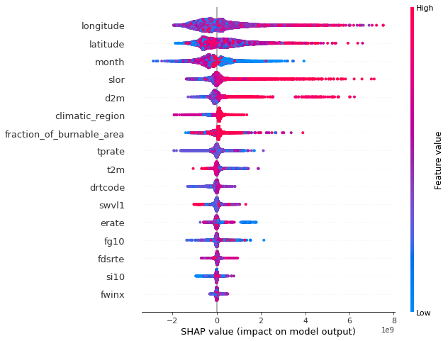

Training LightGBM (Tropics)
================================================================

This notebooks demonstrates training a LightGBM model with
hyperparameter optimization, followed by feature importance
visualization using SHAP. LightGBM is a gradient boosting framework that
uses tree based learning algorithms. This notebook utilizes the
``deepfuel-ML/src/models/lightgbm_module.py`` script for model training.

.. code:: ipython3

    import os
    import pandas as pd
    import numpy as np
    from joblib import dump, load
    import shap

Data directory
~~~~~~~~~~~~~~

.. code:: ipython3

    # The training, validation and test set required for model training are placed in data/tropics/
    ! tree ../data/tropics

.. parsed-literal::

    ../data/tropics
    ├── tropics_test.csv
    ├── tropics_train.csv
    └── tropics_val.csv

    0 directories, 3 files

Input Features
~~~~~~~~~~~~~~

-  Latitude
-  Longitude
-  Fire Weather Index: fwinx
-  Drought Code: drtcode
-  Fire Danegr Severity Rating: fdsrte
-  Fraction of Burnable Area: fraction_of_burnable_area
-  d2m
-  Evaporation Rate: erate
-  fg10
-  si10
-  Volumetric Soil Water Level 1: swvl1
-  2m Temperature: t2m
-  tprate
-  Climatic Region: climatic_region
-  Slope: slor
-  Month: month
-  Fuel Load: actual_load (target variable)

.. code:: ipython3

    # Check header of training set matches input features
    ! head -n 1 ../data/tropics/tropics_train.csv

.. parsed-literal::

    latitude,longitude,fwinx,drtcode,fdsrte,fraction_of_burnable_area,d2m,erate,fg10,si10,swvl1,t2m,tprate,climatic_region,slor,actual_load,month

Model Training
~~~~~~~~~~~~~~

.. code:: ipython3

    !python  '../src/train.py'  --model_name 'LightGBM' --data_path '../data/tropics'  --exp_name 'LightGBM_exp'

.. parsed-literal::

    Link for the created Neptune experiment--------
    Info (NVML): NVML Shared Library Not Found. GPU usage metrics may not be reported. For more information, see https://docs.neptune.ai/logging-and-managing-experiment-results/logging-experiment-data.html#hardware-consumption
    https://ui.neptune.ai/shared/step-by-step-monitoring-experiments-live/e/STEP-168
    ---------------------------------------
    /Users/rbiswas/miniconda3/envs/smos-fuel/lib/python3.8/site-packages/lightgbm/engine.py:156: UserWarning: Found `early_stopping_rounds` in params. Will use it instead of argument
      warnings.warn("Found `{}` in params. Will use it instead of argument".format(alias))
    [LightGBM] [Warning] Unknown parameter: lamda_l2
    [LightGBM] [Warning] Unknown parameter: lamda_l1
    [LightGBM] [Warning] Unknown parameter: lamda_l2
    [LightGBM] [Warning] Unknown parameter: lamda_l1
    [LightGBM] [Warning] Auto-choosing row-wise multi-threading, the overhead of testing was 0.005887 seconds.
    You can set `force_row_wise=true` to remove the overhead.
    And if memory is not enough, you can set `force_col_wise=true`.
    [LightGBM] [Info] Total Bins 3280
    [LightGBM] [Info] Number of data points in the train set: 295013, number of used features: 16
    [LightGBM] [Warning] Unknown parameter: lamda_l2
    [LightGBM] [Warning] Unknown parameter: lamda_l1
    [LightGBM] [Info] Start training from score 1833509820.058491
    [1]	train's rmse: 3.70593e+09	val's rmse: 4.97223e+09
    Training until validation scores don't improve for 20 rounds
    [2]	train's rmse: 3.69441e+09	val's rmse: 4.96466e+09
    [3]	train's rmse: 3.68432e+09	val's rmse: 4.96094e+09
    [4]	train's rmse: 3.67147e+09	val's rmse: 4.94791e+09
    [5]	train's rmse: 3.65895e+09	val's rmse: 4.93876e+09
    [6]	train's rmse: 3.65069e+09	val's rmse: 4.93606e+09
    [7]	train's rmse: 3.63764e+09	val's rmse: 4.92544e+09
    [8]	train's rmse: 3.62504e+09	val's rmse: 4.9169e+09
    [9]	train's rmse: 3.61277e+09	val's rmse: 4.90962e+09
    [10]	train's rmse: 3.60155e+09	val's rmse: 4.90066e+09
    [11]	train's rmse: 3.592e+09	val's rmse: 4.89457e+09
    [12]	train's rmse: 3.58089e+09	val's rmse: 4.88582e+09
    . . .
    [1246]	train's rmse: 1.60812e+09	val's rmse: 4.01095e+09
    [1247]	train's rmse: 1.60776e+09	val's rmse: 4.01099e+09
    [1248]	train's rmse: 1.60739e+09	val's rmse: 4.01119e+09
    [LightGBM] [Warning] No further splits with positive gain, best gain: -inf
    [1249]	train's rmse: 1.60726e+09	val's rmse: 4.01119e+09
    [1250]	train's rmse: 1.60695e+09	val's rmse: 4.01122e+09
    Early stopping, best iteration is:
    [1230]	train's rmse: 1.6122e+09	val's rmse: 4.01059e+09
    RMSE  : 4010589083.0953164
    -----------------------------------------------------------------
    Inference results

    Training error:  1612198733.154914
    Validation error:  4010589083.0953164
    Test error:  2508979611.028168
    Model file save at ['/Users/rbiswas/VSCodeProjects/deepfuel-ML/src/results/pre-trained_models/LightGBM.joblib']

Training logs can be viewed live at the following link:
https://ui.neptune.ai/shared/step-by-step-monitoring-experiments-live/e/STEP-165

Loading the trained model
~~~~~~~~~~~~~~~~~~~~~~~~~

.. code:: ipython3

    model = load('../src/results/pre-trained_models/LightGBM.joblib')

Feature importance using SHAP
~~~~~~~~~~~~~~~~~~~~~~~~~~~~~

`SHAP <https://github.com/slundberg/shap>`__ (SHapley Additive
exPlanations) is a game theoretic approach to explain the output of any
machine learning model. It connects optimal credit allocation with local
explanations using the classic Shapley values from game theory and their
related extensions

.. code:: ipython3

    tropic_val = pd.read_csv('../data/tropics/tropics_val.csv')

.. code:: ipython3

    shap_values = shap.Explainer(model).shap_values(tropic_val.drop(['actual_load'],axis=1))
    shap.summary_plot(shap_values, tropic_val.drop(['actual_load'],axis=1))

The y-axis indicates the variable name, in order of importance from top
to bottom. On the x-axis (Impact on model output), the horizontal
location shows whether the effect of that value is associated with a
higher or lower prediction. Gradient colour indicates feature value.
